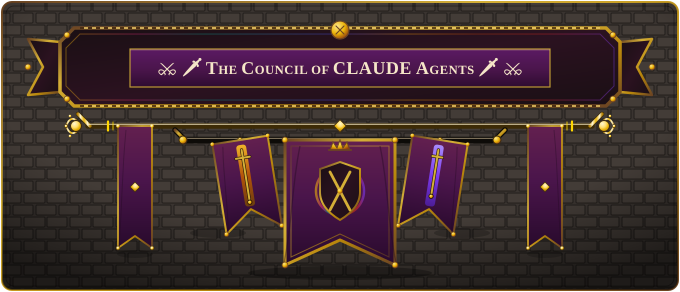

 

# AI Agent Help Instructions

 

> [!NOTE]
> Instructions were editted (and **only editted**) by:
> 
> 

 
Some instructions to help AI coding agents learn how to operate and build the project

 
 

| Topic | Guide |
| --- | --- |
| Overview | [Overview/CLAUDE.md](Overview/CLAUDE.md) |
| Setup | [Setup/CLAUDE.md](Setup/CLAUDE.md) |
| Testing | [Testing/CLAUDE.md](Testing/CLAUDE.md) |
| Documentation | [Documentation/CLAUDE.md](Documentation/CLAUDE.md) |
| Architecture | [Architecture/CLAUDE.md](Architecture/CLAUDE.md) |
| Identity Mods | [IdentityMods/CLAUDE.md](IdentityMods/CLAUDE.md) |
| Downloads | [Downloads/CLAUDE.md](Downloads/CLAUDE.md) |

 

## Council Members

Special Thanks to ❤:

- 

 

